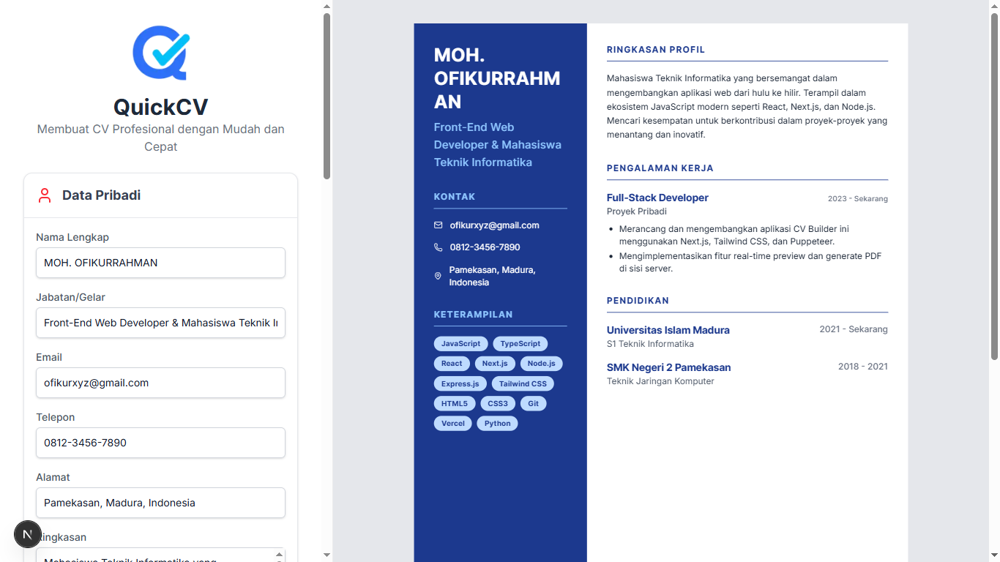

# QuickCV - CV Generator v1.0



QuickCV adalah aplikasi web modern yang memungkinkan kamu untuk membuat, mengedit, dan mengunduh CV profesional dalam format PDF dengan mudah dan cepat. Proyek ini dibangun dengan antarmuka yang bersih, interaktif, dan sepenuhnya responsif.

## ✨ Fitur Utama

- **Formulir Dinamis**: Tambah, edit, dan hapus bagian riwayat pendidikan atau pengalaman kerja secara *real-time*.
- **Pratinjau Langsung**: Lihat perubahan pada CV-mu secara langsung di samping formulir saat kamu mengetik.
- **Penyimpanan Otomatis**: Data yang kamu masukkan akan otomatis tersimpan di browser, jadi tidak akan hilang jika kamu me-refresh halaman.
- **Tombol Reset Cerdas**: Tersedia tombol untuk mereset data dengan dua pilihan: kembali ke contoh awal atau kosongkan semua isian.
- **Notifikasi Pop-up Modern**: Menggunakan pop-up custom yang interaktif, bukan lagi `alert` bawaan browser.
- **Desain Template Profesional**: Dibangun dengan template dua kolom yang modern, bersih, dan mudah dibaca.
- **Unduh PDF Berkualitas Tinggi**: Hasilkan dan unduh CV dalam format PDF dengan kualitas cetak yang tajam.
- **Desain Responsif**: Tampilan optimal di semua perangkat, baik desktop dengan layar lebar maupun mobile dengan layar sempit.

---

## 🛠️ Teknologi yang Digunakan

Proyek ini dibangun menggunakan Next.js dengan API Routes untuk menangani logika backend.

### Frontend (Antarmuka Pengguna)
- **Framework**: [Next.js](https://nextjs.org/) (React)
- **Styling**: [Tailwind CSS](https://tailwindcss.com/)
- **Ikon**: [Lucide React](https://lucide.dev/)

### Backend (Pembuatan PDF)
- **Runtime**: [Node.js](https://nodejs.org/) (via Next.js API Routes)
- **PDF Engine**: [Puppeteer](https://pptr.dev/)
- **Target Browser**: Google Chrome (via `puppeteer-core`)

---

## 🚀 Instalasi & Cara Menjalankan

Untuk menjalankan proyek ini di komputermu, pastikan kamu sudah memiliki **Node.js** (v18+) dan browser **Google Chrome** yang ter-install.

1.  **Clone Repositori**
    Buka terminal dan jalankan perintah berikut:
    ```bash
    git clone [https://github.com/ofikur/cv-generator.git](https://github.com/ofikur/cv-generator.git)
    cd cv-generator
    ```

2.  **Instal Dependensi**
    Instal semua pustaka yang dibutuhkan menggunakan npm.
    ```bash
    npm install
    ```

3.  **Konfigurasi Puppeteer**
    Ini adalah langkah paling penting!
    - Buka file `src/app/api/generate-pdf/route.ts`.
    - Cari baris `executablePath`.
    - Ganti nilainya dengan lokasi `chrome.exe` di komputermu. Contoh untuk Windows:
      ```javascript
      executablePath: 'C:\\Program Files\\Google\\Chrome\\Application\\chrome.exe',
      ```

4.  **Jalankan Server Pengembangan**
    ```bash
    npm run dev
    ```
> Aplikasi akan berjalan di `http://localhost:3000`. Buka alamat ini di browser-mu.

---

## 📜 Lisensi

Proyek ini dirilis di bawah Lisensi MIT. Lihat file `LICENSE` untuk detail lebih lanjut.

---

### Terima Kasih 
#### ~ Ofikur R.